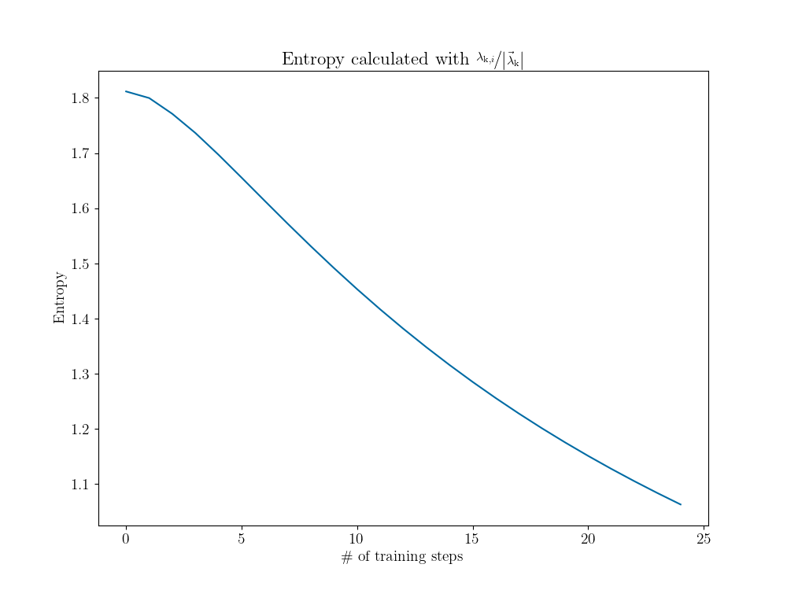
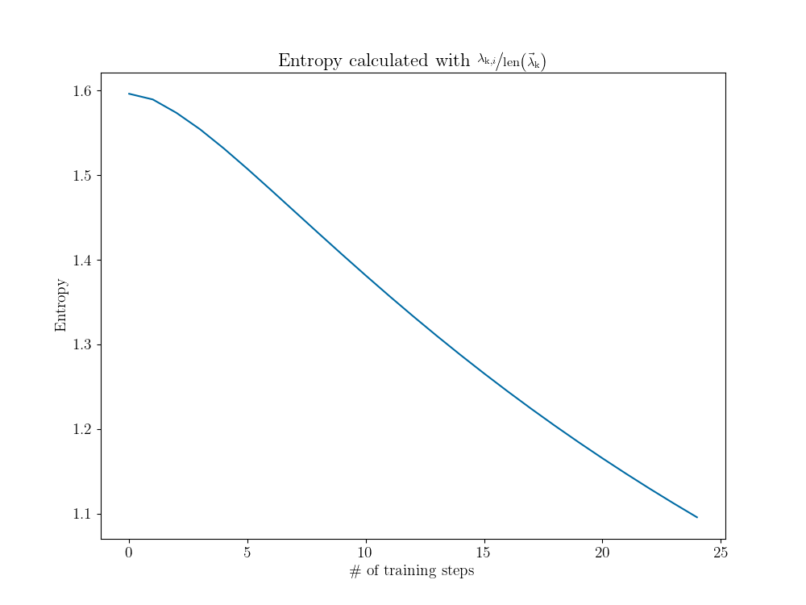

Progress
========

This section documents the progress and the difficulties while working on this project.

Initial dataset
---------------

Convergence criteria
--------------------

There are different approaches to find a good convergence criteria which will be discussed hereafter.

Model variance
++++++++++++++

The model provides a predicted mean as well as an associated variance, the latter being related to uncertainty.
Due to the fact that the model should fit exactly through the training points the variance should be almost zero if the
predicted EP is already in the training set. GPFlow always considers at least a small amount of noise :math:`\left(
\text{noise variance} > {10}^{-6}\right)` which results in the model not running exactly through the training points.
Restricting the model to a noise variance around :math:`{10}^{-6}` leads to unexpected behavior which can be seen in
:numref:`noise dependency`.

.. figure:: images/model_noise_dependency_55-2.png
    :width: 100 %
    :align: center
    :name: noise dependency

    Both pictures show the parameter plane (here it is the complex plane of :math:`\kappa`). The color bar denotes the
    number of training steps. The orbit (i.e. # of training steps = 0) serves as the initial dataset and all further
    kappa values (i.e. # of training steps > 0) are the model's prediction for the EP at each step. The left figure
    shows the predicted kappa values by a model with the default noise variance. It converges against the EP. A model
    with noise variance :math:`\approx {10}^{-6}` leads to an unexpected behavior, which can be observed in the
    right figure.

.. raw:: html
    :file: images/model_noise_dependency_55-3

Therefore it is quite difficult to find a suitable value for the variance as convergence parameter. If it is too large
the model is not converged against the EP which leads to a wrong prediction of the EP. A too small value results in a
problem because many almost identical values are used to train the model. This leads to another possible convergence
criteria.

Kernel eigenvalues
++++++++++++++++++

`Has to be edited!`

The parameter space (e.g. the :math:`\kappa` space) is the input space of the kernel function for which the eigenvalues
:math:`\lambda_\text{k}`
can be calculated. The more :math:`\kappa` values, the smaller the eigenvalues become. If there are a lot of training
points especially if they are close together like in the left picture of :numref:`noise dependency`, a drop in the
eigenvalues is visible from :math:`\mathcal{O}\left(10^{-2}\right)` to :math:`\mathcal{O}\left(10^{-16}\right)`. An
interpretation for this drop is that the model has already seen this new training point and therefore is not receiving
any new information from it. This can also be used as a convergence criteria. It gives no information about the EP but 
if this drop occurs it could be better to use new training points, e.g. drawing a new circle in the parameter space 
with the predicted EP as center and a smaller radius. This can be combined with other convergence parameters (already 
done).

**Entropy**

The entropy can be calculated from the kernel eigenvalues :math:`\lambda_\text{k}`. When plotting the entropy over the
number of training steps one
should observe a drop at the training step where the eigenvalue drop occurs. Until now it was not possible to see this
drop. A possible reason is that the matrix is not unitary which results in not normalized eigenvalues. Calculating the
entropy from these leads to negative entropy values.

At the moment there are two approaches to normalize the eigenvalues :math:`\lambda_\text{k}`. The first one is to
normalize the vector containing all eigenvalues to get the entropy

.. math::

    S = -\sum_i \frac{\lambda_{\text{k}, i}}{\left||\vec{\lambda}_\text{k}|\right|} \cdot \log\left(\frac{
    \lambda_{\text{k}, i}}{\left||\vec{\lambda}_\text{k}|\right|}\right)\, ,

where :math:`i` denotes an element of the vector :math:`\vec{\lambda}_\text{k}`. This leads to an entropy curve as shown
in :numref:`entropy normalized`.

    The entropy calculated from the kernel eigenvalues normalized by the norm of the kernel eigenvalue vector
    :math:`\left||\vec{\lambda}_\text{k}|\right|`.

The other approach is to normalize by
the length of the vector :math:`\text{len}\left(\vec{\lambda}_\text{k}\right)`, i.e. the number of elements, which
leads to the entropy

.. math::

    S = -\sum_i \frac{\lambda_{\text{k}, i}}{\text{len}\left(\vec{\lambda}_\text{k}\right)} \cdot \log\left(\frac{
    \lambda_{\text{k}, i}}{\text{len}\left(\vec{\lambda}_\text{k}\right)}\right)

This results in an entropy curve shown in :numref:`entropy divided length`.

    The entropy calculated from the kernel eigenvalues normalized by the length of the kernel eigenvalue vector
    :math:`\text{len}\left(\vec{\lambda}_\text{k}\right)`.

`Further research required!`

Eigenvalue difference
+++++++++++++++++++++

At the EP the difference of the two eigenvalues should be zero due to their degeneracy. Because of this square root
behavior the gradient is infinite at the EP which results in a strong dependency of the eigenvalue difference and the
:math:`\kappa` value. This strong dependence is also the reason why it is very difficult to find a suitable value for 
the eigenvalue difference as convergence parameter. However this seems to be the best convergence criteria so far
since it is directly related to a property of an EP.

As visible in :numref:`noise dependency` there is already a really good prediction for the EP after the second training
step. After that the model jumps away and converges slowly towards the EP again. Thus a suitable value for the 
eigenvalue difference could be a promising convergence parameter to prevent the model from overtraining.
`Further research required!`

Model accuracy
--------------

.. figure:: images/model_accuracy_diff.png
    :width: 100 %
    :align: center
    :name: accuracy diff

.. figure:: images/model_accuracy_sum.png
    :width: 100 %
    :align: center
    :name: accuracy sum
