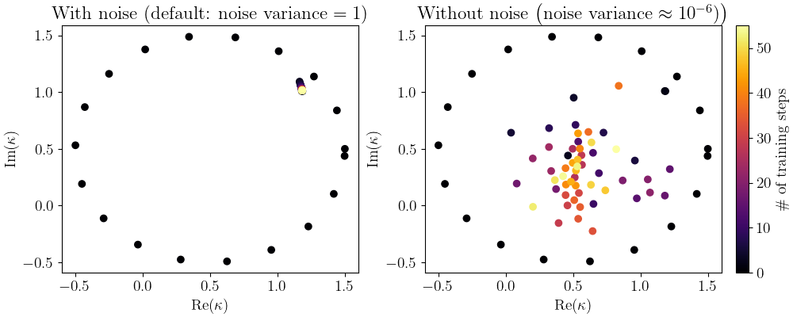
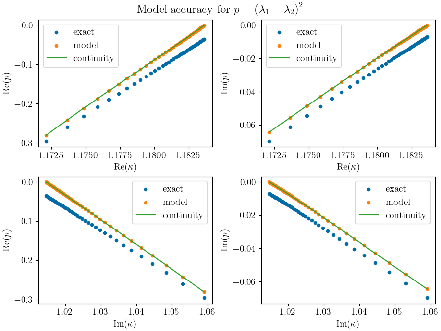
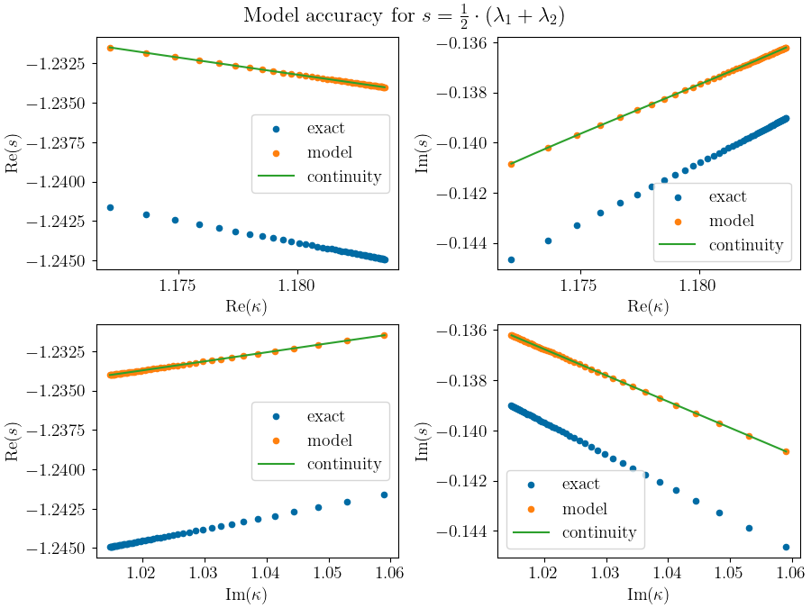

Progress
========

This section documents the progress and the difficulties while working on this project.

Convergence criteria
--------------------

There are different approaches to find a good convergence criteria which will be discussed hereafter.

Model variance
++++++++++++++

The model provides a predicted mean as well as an associated variance, the latter being related to uncertainty.
Due to the fact that the model should fit exactly through the training points the variance should be almost zero if the
predicted EP is already in the training set. GPFlow always considers at least a small amount of noise :math:`\left(
\text{noise variance} > {10}^{-6}\right)` which results in the model not running exactly through the training points.
Restricting the model to a noise variance around :math:`{10}^{-6}` leads to unexpected behavior which can be seen in
:numref:`noise dependency`.

    Both pictures show the parameter plane (here it is the complex plane of :math:`\kappa`). The colorbar denotes the
    number of training steps. The orbit (i.e. # of training steps = 0) serves as the initial dataset and all further
    kappa values (i.e. # of training steps > 0) are the model's prediction for the EP at each step. The left figure
    shows the predicted kappa values by a model with the default noise variance. It converges against the EP. A model
    with noise variance :math:`\approx {10}^{-6}` leads to an unexpected behavior, which can be observed in the
    right figure.

.. raw:: html
    :file: images/model_noise_dependency_55-3

Therefore it is quite difficult to find a suitable value for the variance as convergence parameter. If it is too large
the model is not converged against the EP which leads to a wrong prediction of the EP. A too small value results in a
problem because many almost identical values are used to train the model. This leads to another possible convergence
criteria.

Kernel eigenvalues
++++++++++++++++++

Model accuracy
--------------

